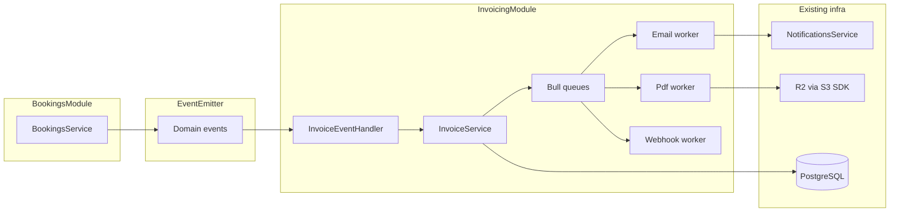

# Invoicing module — architecture plan (RentMyVroom backend)

## Current stack vs your reference doc

| Reference assumption | [rentmyvroom](d:/noorul/rent-my-vroom/rentmyvroom) today |
|----------------------|----------------------------------------------------------|
| TypeORM entities | **Prisma** — add models in [`prisma/schema.prisma`](d:/noorul/rent-my-vroom/rentmyvroom/prisma/schema.prisma), access via [`PrismaService`](d:/noorul/rent-my-vroom/rentmyvroom/src/prisma/prisma.service.ts) |
| `EmailModule` + Brevo template IDs | **[`NotificationsModule`](d:/noorul/rent-my-vroom/rentmyvroom/src/notifications/notifications.module.ts)** — [`NotificationsService.sendTransactionalEmail(to, subject, html)`](d:/noorul/rent-my-vroom/rentmyvroom/src/notifications/notifications.service.ts) (HTML in code, same pattern as [`renderOtpEmail`](d:/noorul/rent-my-vroom/rentmyvroom/src/notifications/templates/email-templates.ts)) |
| UUID keys | **Integer** `@id @default(autoincrement())` on `User`, `Booking`, etc. |
| Bull queues | **Not present** — add `@nestjs/bull` + `bull` + **Redis** (new infra) |
| Domain events | **Not present** — add `@nestjs/event-emitter` |
| `booking.confirmed` | Align to **`BookingStatus.ACCEPTED`** (and optionally **offline** `ACCEPTED` / `COMPLETED` — product decision; see triggers below) |
| `payment.captured` | **No payment gateway** — offline fields `paymentMethod`, `amountCollected` on [`Booking`](d:/noorul/rent-my-vroom/rentmyvroom/prisma/schema.prisma); treat “receipt” as **post-`updateOfflinePayment`** or **completion** |
| Payout / commission | **No payout domain** yet — design **interfaces + no-op or stub** handlers so the module stays complete without blocking v1 |

---

## Design principles (mapped to this repo)

1. **Event-driven boundary** — `InvoicingModule` does **not** import `BookingsModule`. After successful Prisma updates in [`BookingsService`](d:/noorul/rent-my-vroom/rentmyvroom/src/bookings/bookings.service.ts) (`acceptBooking`, `cancelBooking`, `cancelOfflineBooking`, `completeBooking`, `updateOfflinePayment`, `createOffline`), emit small **payload DTOs** (bookingId, merchantId, renterId, amounts, source, status). Listeners live in `InvoicingModule` only.
2. **Modular Nest module** — Single [`InvoicingModule`](d:/noorul/rent-my-vroom/rentmyvroom/src) registered from [`app.module.ts`](d:/noorul/rent-my-vroom/rentmyvroom/src/app.module.ts); **exports** only a narrow facade (e.g. `InvoiceService` or `InvoicingFacade`) if other modules ever need imperative calls.
3. **Async PDF/email/webhook** — New **Bull** queues mirror your topology; tune concurrency and Bull `limiter` to Brevo limits.
4. **Audit trail** — `InvoiceStatusHistory` (append-only) + `InvoiceDeliveryLog` as in your spec.
5. **Multi-tenant templates** — `InvoiceTemplate` keyed by `merchantId` (nullable row = platform default), **Handlebars** (or same string-template approach as OTP) stored in DB; resolved in `InvoiceTemplateService`.
6. **Storage adapter** — **Do not** overload client presigned-upload flow in [`UploadsService`](d:/noorul/rent-my-vroom/rentmyvroom/src/uploads/uploads.service.ts) for PDFs. Add **`InvoiceStorageService`** (or `ServerBlobStorage`) implementing `putBuffer(key, body, contentType)` using the same R2 env vars pattern (`S3Client` + `PutObjectCommand`), plus reuse `buildPublicUrl` semantics for **public PDF URLs** (or signed GET if you prefer private objects later).
7. **Email abstraction for future Brevo templates** — Introduce a thin port, e.g. `InvoiceEmailPort`, with one implementation today: **`HtmlInvoiceEmailAdapter`** calling `NotificationsService.sendTransactionalEmail`. Later: **`BrevoTemplateInvoiceEmailAdapter`** using Brevo template IDs + params (extend `NotificationsService` or add a dedicated client wrapper **without** putting Brevo details inside invoicing domain logic).

---

## Invoice triggers (realistic v1 mapping)

| Your domain event | Suggested emission point in `BookingsService` | Invoice type |
|-------------------|-----------------------------------------------|--------------|
| Booking “confirmed” | After **`acceptBooking`** success | `BOOKING` |
| | After **`createOffline`** when `status === ACCEPTED` (and optionally when `COMPLETED` if you want a single consolidated invoice — **pick one rule** to avoid duplicates) | `BOOKING` |
| Payment / receipt | After **`updateOfflinePayment`** when `amountCollected` becomes set/changed, or after **`completeBooking`** for a receipt-style doc | `RECEIPT` (only if not duplicate with booking invoice) |
| Cancel / credit | After **`cancelBooking`** / **`cancelOfflineBooking`** | `REFUND` or `CREDIT_NOTE` (link to original invoice in `metadata` / new FK `originalInvoiceId`) |
| Payout / period | **Stub**: handler registered, no-op until payout tables exist | `PAYOUT` / `COMMISSION` |

**Important:** “Booking invoice” vs “Receipt” overlap — define a **single policy** (e.g. issue `BOOKING` on accept; issue `RECEIPT` only when `amountCollected` is first recorded for offline, or skip `RECEIPT` in v1). Document the rule in code comments and API docs.

---

## Data layer (Prisma)

- Add enums: `InvoiceType`, `InvoiceStatus`, `LineItemType`, `DeliveryChannel`, `DeliveryStatus` (match your state machine; align `PAID`/`OVERDUE` with whether you actually track payment deadlines—may stay unused until online payments exist).
- Add models: `Invoice`, `InvoiceLineItem`, `InvoiceStatusHistory`, `InvoiceTemplate`, `InvoiceNumberSequence`, `InvoiceDeliveryLog` with relations to `Booking` / `User` as **optional `Int` FKs** where nullable (offline renter, etc.).
- **PostgreSQL `invoicing` schema**: Enable Prisma **multi-schema** for PostgreSQL (`schemas` in `datasource`, `@@schema("invoicing")` on models) *or*, if you want to avoid preview/config complexity, use **`@@map("invoicing_invoice")`** naming under `public`. Prefer **dedicated schema** if your DB migration process already allows it.
- **Indexes**: mirror your list (`bookingId+type`, `merchantId+issuedAt`, `renterId+issuedAt`, `status+dueAt`, unique `invoiceNumber`, line items by `invoiceId+sortOrder`).
- **Numbering**: implement with **transaction + row lock** on `InvoiceNumberSequence` (`findFirst` + `update` in `$transaction`, or raw SQL `FOR UPDATE`) — Prisma-friendly variant of your `SKIP LOCKED` idea.

---

## Application layer (inside `src/invoicing/`)

Mirror your proposed layout (domain / application / infrastructure) but **Prisma-backed repositories** instead of TypeORM:

- **`InvoiceService`** — orchestration, status transitions, writes history rows, enqueue jobs.
- **`InvoiceGeneratorService`** — builds line items from `Booking` + `Vehicle` + merchant/renter (and offline customer fields); uses **decimal.js** (new dependency) for money math.
- **`InvoiceTemplateService`** — `resolveTemplate(merchantId)`, `renderHtml`, CRUD for merchant template + preview.
- **`InvoiceNumberingService`** — scoped by `merchant` + `type` prefix + year.
- **`PdfService`** — HTML → PDF (**puppeteer-core** + pinned Chromium in Docker — align with your new [`Dockerfile`](d:/noorul/rent-my-vroom/rentmyvroom/Dockerfile) if deploying Linux containers; Windows dev may use `PUPPETEER_EXECUTABLE_PATH`).
- **`InvoiceDeliveryService`** — builds **subject + HTML** from Handlebars + invoice DTO; calls `InvoiceEmailPort`; logs to `InvoiceDeliveryLog`; optional attachment: Brevo send API may need **base64 attachment** when not using hosted URL — verify Brevo SDK support vs **link-only** email (simplest v1: **PDF link** in email body, no attachment).
- **`InvoiceWebhookService`** — HMAC signing, retries via `invoice-webhook` queue (merchant webhook URL can start in `SystemConfig` or a nullable column on `User` for merchants).

**Workers:** `PdfProcessor`, `EmailProcessor`, `WebhookProcessor` as `@Processor` classes; **chain** PDF → email job as in your doc.

---

## REST API

- Current app has **no global `/api/v1` prefix** in [`main.ts`](d:/noorul/rent-my-vroom/rentmyvroom/src/main.ts). Either add a global prefix for new routes only (`@Controller('invoices')`) or nest under existing auth: follow **JWT guards** pattern used in [`bookings.controller.ts`](d:/noorul/rent-my-vroom/rentmyvroom/src/bookings/bookings.controller.ts) / admin.
- Endpoints from your table, adapted to **integer IDs** in path params.
- **Authorization:** renter sees own invoices; merchant sees own; admin sees all — reuse role checks from existing modules.

---

## Integration steps (minimal coupling)

1. Add **`EventEmitterModule.forRoot({ wildcard: false })`** to [`AppModule`](d:/noorul/rent-my-vroom/rentmyvroom/src/app.module.ts) (or import into `BookingsModule` + `InvoicingModule` per Nest docs).
2. Define **event classes** (e.g. `BookingAcceptedEvent`, `BookingCancelledEvent`, …) under `src/bookings/events/` or `src/common/events/`.
3. Inject `EventEmitter2` into `BookingsService` and **emit after** successful Prisma updates (same places as today’s `messagingService.notify*` calls — events are additive).
4. **`BookingsModule` must not import `InvoicingModule`** — only `EventEmitterModule` if needed for typing; handlers register from `InvoicingModule`.

---

## Dependencies and ops

| Package | Purpose |
|---------|---------|
| `@nestjs/bull`, `bull` | Queues |
| `ioredis` / peer | Redis connection for Bull |
| `@nestjs/event-emitter` | Domain events |
| `handlebars` | Invoice HTML + email body |
| `puppeteer-core` (+ chromium in Docker) | PDF |
| `decimal.js` | Money |

- **Redis**: required for Bull; document in [`.env.example`](d:/noorul/rent-my-vroom/rentmyvroom/.env.example).
- **Worker topology**: Option A — same Nest process runs consumers (simplest). Option B — separate `nest start` entry / CLI flag for **queue workers** (scalable CPU for Puppeteer).

---

## Testing strategy

- **Unit:** `InvoiceGeneratorService`, `InvoiceNumberingService` (transactional numbering with Prisma test DB or mocked client).
- **Integration:** event handler creates `DRAFT`/`ISSUED` invoice when `acceptBooking` is called in a test module with `EventEmitter` + in-memory or test Redis (or mock queues for CI).

---

## Merchant web / mobile

- **Out of scope** for this backend-only plan unless you explicitly add: merchant dashboard invoice list ([`merchant-web`](d:/noorul/rent-my-vroom/merchant-web)) and renter views in **rent-my-vroom-mob** calling new REST endpoints.

---

## Phased delivery (reusability / scalability)

1. **Foundation** — Prisma models + migrations, `InvoicingModule` skeleton, `InvoiceEmailPort` + HTML adapter, storage port + R2 upload, Bull wiring.
2. **Core flow** — `BOOKING` invoice on `acceptBooking` (+ agreed offline rule), PDF pipeline, email with in-repo template, delivery log.
3. **REST** — list/get/pdf/void/resend + merchant template CRUD/preview.
4. **Cancellations** — credit note + void/link original.
5. **Webhooks** — optional feature-flagged.
6. **Future** — implement `BrevoTemplateInvoiceEmailAdapter`; payout/commission when domain exists; consider **BullMQ** migration if you outgrow `bull`.
